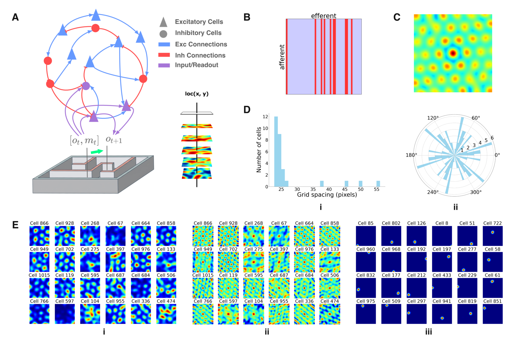

<h1 align="center">A Simple Model of Co-Emergence of Grid and Place Fields</h1>

<p align="center">
  <strong>
    A Dale-constrained recurrent network trained only to predict the next sensory observation
    can self-organize into both place-like and grid-like spatial codes.
  </strong>
</p>

<p align="center">
  <a href="https://arxiv.org/abs/2605.21356">
    
  </a>
  &nbsp;&nbsp;&nbsp;
  <a href="https://zhaozewang.github.io/grid-and-place">
    
  </a>
  &nbsp;&nbsp;&nbsp;
  <a href="https://github.com/grasp-lyrl/grid_and_place">
    
  </a>
  &nbsp;&nbsp;&nbsp;
  <a href="https://colab.research.google.com/github/grasp-lyrl/grid_and_place/blob/main/notebooks/co_emergence.ipynb">
    
  </a>
</p>

<p align="center">
  
</p>


## About

This repository contains the official implementation of **A simple model of co-emergence of grid and place fields**.

Grid cells in the medial entorhinal cortex fire in periodic, hexagonally arranged spatial fields and are often associated with path integration and internal spatial coordinates. Place cells in the hippocampus fire at specific locations and are often associated with sensory context, memory, and self-localization.

A central question is how these two spatial codes arise together. Many existing theories derive one from the other, or assume that one code already exists. This creates a developmental and mechanistic "chicken-and-egg" problem: if grid cells need place cells, and place cells need grid cells, how does the system get started?

We propose that grid and place fields can co-emerge from a single self-supervised objective: predicting the next sensory observation during navigation. The model is not supervised with position, grid-cell targets, or place-cell targets. Instead, it receives corrupted sensory observations and egocentric motion signals, and learns to predict the next uncorrupted sensory observation.

## Keywords

`grid cells`, `place cells`, `hippocampus`, `entorhinal cortex`, `spatial navigation`, `self-supervised learning`, `recurrent neural networks`, `Dale's Law`

## Setup

```bash
python -m venv venv
source venv/bin/activate
pip install --upgrade pip
pip install -e .
```

Install pytorch following the instructions on https://pytorch.org/get-started/locally/.
```bash
pip3 install torch
```

## Run the experiments

### Base experiment
```bash
python train.py --config co_emergence --name co_emergence --save_dir default
```
Base experiment with clear grid cell emergence
```bash
python train.py --config co_emergence_clear_gc --name co_emergence_clear_gc --save_dir default
```

### Save more frequently to record the co-emergence sequence of two cell types
```bash
python train.py --config co_emergence --name co_emergence_sequence --save_dir default logging.save_every=2000
```

### Spatial Autocorrelograms
To compute spatial autocorrelograms for saved ratemaps, run the command below. The input should be a `.npz` file whose name starts with `ratemap` and contains a `ratemap` array. The `utils.analyze.compute_autocorr` module saves the result in the same directory, replacing the filename prefix `ratemap` with `autocorr`.
```bash
python -m utils.analyze.compute_autocorr runs/paper/co_emergence_clear_gc/ratemap_free_step_200000.npz
```

### Visualization

The main visualization notebook is [`notebooks/co_emergence.ipynb`](notebooks/co_emergence.ipynb). You can also view it online through [nbviewer](https://nbviewer.org/github/grasp-lyrl/grid_and_place/blob/main/notebooks/co_emergence.ipynb). The notebook loads saved ratemaps and autocorrelograms, then reproduces the main co-emergence visualizations.
